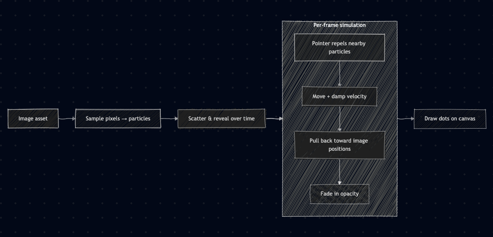

# particles_image

Flutter demo: PNG assets are sampled into colored dots that scatter, assemble, and react to the pointer.

## Pipeline



**rasterize** (`lib/utils/rasterize.dart`) — loads a bundled PNG, scales it to `imageSize`, samples opaque pixels on a grid, assigns each dot a rest position and a random scattered start.

**Reveal** (`ParticleCanvas`, `_revealed`) — activates more particles each frame (`revealed += revealPerFrame`) until the full list is live.

**Particle physics** (`ParticleCanvas._step`) — integrates velocity, applies pointer repulsion, damping, and spring-back each frame.

**ParticlePainter** (`lib/widgets/particle_painter.dart`) — draws revealed dots on the canvas.

## Run

```bash
flutter run -d chrome   # or macos / ios / android
```

## Formulas

| Step | Formula |
| --- | --- |
| Image scale (if width > `imageSize`) | `scale = imageSize / srcWidth`, `w = round(srcWidth · scale)`, `h = round(srcHeight · scale)` |
| Image center on canvas | `originX = (canvasWidth − w) / 2`, `originY = (canvasHeight − h) / 2` |
| Grid sample step | `step = clamp(gap, 1, 999)`; sample at `(px, py)` for `px += step`, `py += step` |
| Opaque pixel test | skip if `α / 255 < 0.4` where `α` is the pixel’s alpha channel |
| Rest position | `restX = originX + px`, `restY = originY + py` |
| Scatter start | `x₀ = restX + U(−½, ½) · canvasWidth · scatter`, `y₀ = restY + U(−½, ½) · canvasHeight · scatter` |
| Reveal batch | `revealed = min(particleCount, revealed + revealPerFrame)` |
| Distance to pointer | `d = √(dx² + dy²)` where `dx = x − pointerX`, `dy = y − pointerY` |
| Hover impulse (linear falloff) | `strength = (1 − d / hoverRadius) · hoverForce` when `0.0001 < d < hoverRadius`, else `0` |
| Impulse direction | `(nx, ny) = (dx / d, dy / d)` |
| Velocity update | `vx += nx · strength`, `vy += ny · strength` |
| Position integration | `x += vx`, `y += vy` |
| Damping | `vx *= damping`, `vy *= damping` |
| Spring to rest | `x += (restX − x) · assembleSpeed`, same for `y` |
| Fade-in | `opacity = min(1, opacity + fadeInStep)` |

Default tunables live in `Settings` (`lib/models/settings.dart`).

| Field | Default | Notes |
| --- | --- | --- |
| `dotRadius` | 1.6 | Draw radius |
| `hoverRadius` | 80 | Pointer influence radius |
| `hoverForce` | 6 | Repulsion strength |
| `damping` | 0.86 | Per-frame velocity decay |
| `assembleSpeed` | 0.06 | Pull toward rest |
| `fadeInStep` | 0.04 | Opacity ramp per frame |
| `revealPerFrame` | 40 | Particles activated per frame |
| `gap` | 4 | Sample grid spacing (re-rasterize on change) |
| `scatter` | 0.7 | Start offset scale (re-rasterize on change) |
| `imageSize` | 300 | Max raster width (re-rasterize on change) |

Bundled images are listed in `kSources` (`lib/constants.dart`).
